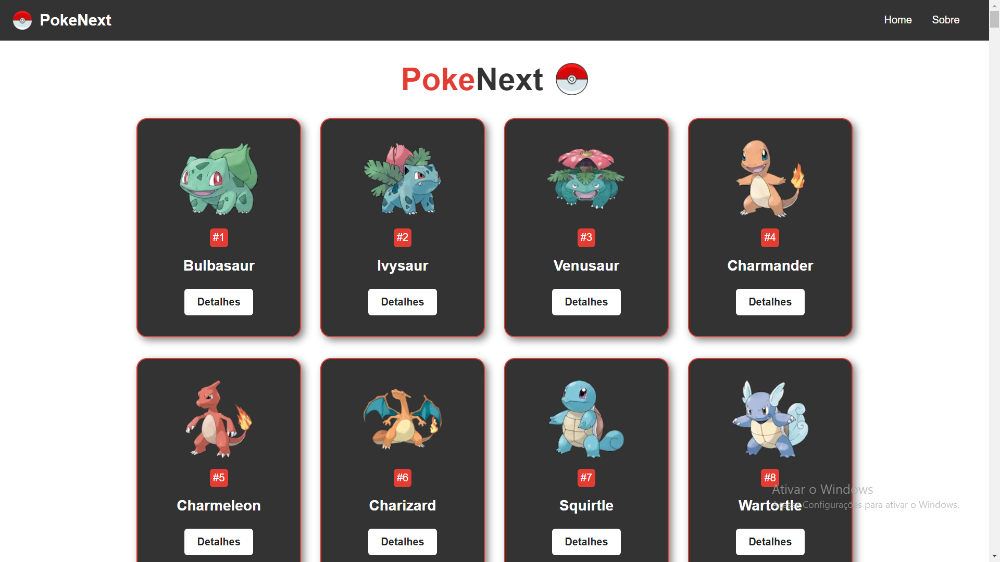

# PokeNext - Next.js
This is a [Next.js](https://nextjs.org/) project bootstrapped with [`create-next-app`](https://github.com/vercel/next.js/tree/canary/packages/create-next-app).

- Link Next.js - for navigation
- Fetch data - for API requisition
- getStaticProps and getStaticPaths - for Routes Dynamics
- Layout styling and componentization

### Result

 


## Install & Run

First install all dependencies and run the development server:

**1. Install dependencies**

```bash
npm install
# or
yarn install
```

**2. Start up**
````bash
npm run dev
# or
yarn dev
````
**3. Open with your browse**
Open [http://localhost:3000](http://localhost:3000) with your browser to see the result.

